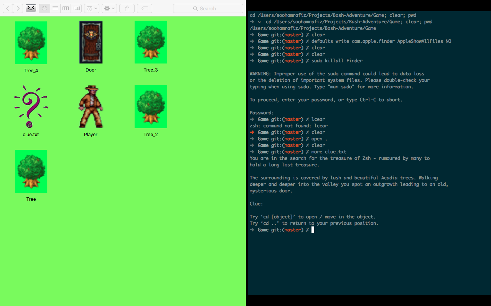

# Bash Adventure
Welcome!

Bash Adventure is a game designed with the focus to teach users
about the **Bash UNIX shell** (informally known as the 'shell' or 'terminal').
Follow the instructions below to begin the game.

1. Open the Terminal Application (located in **Applications > Utilities > Terminal **).
2. Learn the basics of terminal by reading the BASICS.txt file
3. Naviage to the Game folder and close all other finder windows.
3. You're all set to play!

Designed by Sooham Rafiz for CSC299 Research Programme.
Homage to old CLI games.
